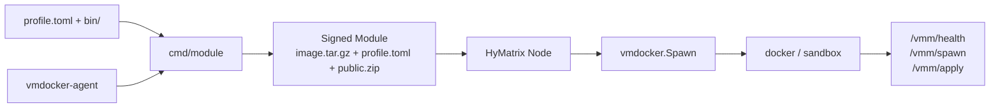

<div align="center">

# VMDocker V2

**Container runtime for HyMatrix**

[](go.mod)
[](LICENSE)

[简体中文](README_zh.md)

</div>

VMDocker V2 packages Docker images as signed, distributable, verifiable HyMatrix Modules and runs them in isolated `docker` or `sandbox` backends.

**Module Format:** `hymx.vmdockerv2.v0.0.1`

## Where to start

| Goal | Start here |
|---|---|
| Understand the project | [Architecture](#2-architecture) |
| Validate the repository | [Quick start](#3-quick-start) |
| Build your own Module | [Build and run a Module](#4-build-and-run-a-module) |
| Run build → Spawn → Export → re-Spawn | [Manual end-to-end round trip](docs/manual-roundtrip-test.md) |
| Troubleshoot runtime issues | [Troubleshooting](#8-troubleshooting) |

## 1. Overview

VMDocker V2 is a VM extension for HyMatrix nodes. On Spawn, it validates the Module, prepares its image and workspace, starts the runtime, and forwards VM calls through `/vmm/*` endpoints.

V2 builds at Module creation time, not at Spawn time. A Module carries its compressed image, `profile.toml`, and optional `public.zip`, so the runtime host does not need a Dockerfile or an online rebuild.

Typical use cases:

- Run containerized workloads on a HyMatrix node.
- Package Claude, OpenClaw, or a custom agent as a Module.
- Isolate per-process workspaces with controlled export.

## 2. Architecture



The request path is:

1. Module authors declare the base image, tools, command, and public files in `profile.toml`.
2. `cmd/module` generates a standard Dockerfile, builds and saves the image, then signs `mod-<id>.json`.
3. On Spawn, the node validates the format and image digest, loading the image from the Module on a cache miss.
4. Each process gets an isolated workspace, while the embedded `vmdocker-agent` serves the VM HTTP protocol.

## 3. Quick start

### 3.1 Prerequisites

| Dependency | Purpose |
|---|---|
| Go 1.24.2+ | Build and test `vmdockerv2` |
| Go 1.25+ | Build the sibling `vmdocker_agent` repository when authoring Modules |
| Docker CLI and daemon | Build Modules and run container workloads |
| Redis | Start the HyMatrix node |
| `vmdocker_agent` | Required only when authoring a Module |

Linux defaults to `docker`. macOS and Windows default to `sandbox` and require Docker Desktop with `docker sandbox`; `docker` can also be selected explicitly at Spawn time.

### 3.2 Validate the repository

```bash
git clone https://github.com/cryptowizard0/vmdockerv2.git
cd vmdockerv2

go test ./...
go build -o ./build/hymx-node ./cmd
```

Success means the tests pass and `build/hymx-node` is created.

### 3.3 Start a local node

Start Redis first:

```bash
docker run -d --name vmdockerv2-redis -p 6379:6379 redis:7-alpine
```

Start the node with the repository's development config. It contains a public test key and must never be used in production.

```bash
./build/hymx-node --config ./cmd/config.yaml
```

Verify it from another terminal:

```bash
curl -fsS http://127.0.0.1:8080/info
```

A JSON node response confirms the HTTP service is ready. `/vmm/health` belongs to runtime containers and is not the node's public health endpoint.

### 3.4 Local capability test without a chain

```bash
bash scripts/e2e_capability.sh
```

This validates Module contents, workspace seeding, and container mounts. Real image build and Spawn are opt-in:

```bash
RUN_REAL_SPAWN=1 bash scripts/e2e_capability.sh
```

## 4. Build and run a Module

This flow is for Module authors. See [profile-module-guide.md](docs/profile-module-guide.md) for the full schema, artifacts, and cold-start behavior.

For detailed, copyable steps from adapter build through Spawn, Export, and re-Spawn, follow the [manual end-to-end round-trip guide](docs/manual-roundtrip-test.md).

### 4.1 Build the platform adapter

Every Module image uses `vmdocker-agent` as its fixed entrypoint. It comes from the sibling repository and must match the target image architecture.

```bash
cd ../vmdocker_agent
scripts/build.sh
export VMDOCKER_AGENT_BIN="$PWD/build/vmdocker-agent"
cd ../vmdockerv2
```

Use `scripts/build.sh amd64` or `scripts/build.sh arm64` to select a target architecture.

### 4.2 Create a minimal profile

```text
myagent/
├── profile.toml
├── bin/
│   └── .keep
└── skills/
    └── soul.md
```

`myagent/profile.toml`:

```toml
[dockerfile]
FROM = "docker/sandbox-templates:shell"
bin = "bin"
# CMD = ["my-agent", "--serve"]

[vmdocker]
public = ["~/skills/*"]
```

`FROM` and `bin` are required. `bin` may be empty, but the directory must exist. `CMD` is optional and is launched by the fixed adapter entrypoint.

### 4.3 Configure the build environment

```bash
cp .env.example .env
```

Use one `.env` file for Module builds and example programs:

```dotenv
VMDOCKER_AGENT_BIN=/absolute/path/to/vmdocker_agent/build/vmdocker-agent
VMDOCKER_URL=http://127.0.0.1:8080
VMDOCKER_PRIVATE_KEY=0xreplace_with_a_development_key
RUNTIME_BACKEND=docker
```

`.env` is ignored by Git. Never commit a real private key.

`cmd/module` requires `VMDOCKER_PRIVATE_KEY` and an adapter path, provided by `VMDOCKER_AGENT_BIN` or `-agent-bin`. `VMDOCKER_URL` is primarily used by the examples to reach the node.

### 4.4 Build and save the Module

```bash
go run ./cmd/module \
  -profile ./myagent/profile.toml \
  -agent-bin "$VMDOCKER_AGENT_BIN"
```

The command runs `docker build`, `docker save`, and signing, then writes `mod-<id>.json`. Place it in the node working directory's `mod/` folder:

```bash
mkdir -p mod
cp mod-<id>.json mod/mod-<id>.json
```

### 4.5 Spawn the Module

Add the generated Module ID and the node account returned by `/info` to `.env`:

```dotenv
VMDOCKER_MODULE_ID=<module-id>
VMDOCKER_SCHEDULER=<node-account-id>
RUNTIME_BACKEND=docker
```

A fresh full node may need Token and Registry initialization before Spawn:

```bash
go run ./examples init
go run ./examples spawn
```

Success prints `spawned pid: <process-id>`. Follow the [manual end-to-end round-trip guide](docs/manual-roundtrip-test.md) for the complete Spawn, Export, and re-Spawn procedure.

## 5. Runtime backend

The `Runtime-Backend` Spawn tag selects the backend. It is not stored in the Module: the Module describes the image, while Spawn chooses how to run this instance.

| Platform | Default | Available | Notes |
|---|---|---|---|
| Linux | `docker` | `docker` | Linux rejects `sandbox` |
| macOS / Windows | `sandbox` | `sandbox`, `docker` | `sandbox` needs the Docker Sandbox CLI |

```go
[]schema.Tag{{Name: "Runtime-Backend", Value: "docker"}}
```

Pass the runtime type through `Container-Env-RUNTIME_TYPE`. It controls adapter readiness for values such as `claude`, `openclaw`, or `test`; it is not a `profile.toml` field.

## 6. Configuration

The node reads YAML configuration. Start with [cmd/config.yaml](cmd/config.yaml) for development; replace keys, URLs, and network settings in production.

| Field | Description | Example |
|---|---|---|
| `port` | HTTP listen address | `:8080` |
| `ginMode` | Gin mode | `debug`, `release` |
| `redisURL` | Redis for node state | `redis://@localhost:6379/0` |
| `arweaveURL` | Arweave gateway | `https://arweave.net` |
| `hymxURL` | Node URL used by the SDK | `http://127.0.0.1:8080` |
| `prvKey` | Node private key; takes precedence when set | `0x...` |
| `keyfilePath` | Used when `prvKey` is empty | `./keyfile.json` |
| `nodeName` | Node name | `my-node` |
| `nodeURL` | URL reachable by peers | `https://node.example.com` |
| `joinNetwork` | Join the network | `false`, `true` |

`enablePayment` and `enableChainkit` are optional subsystems. Their settings are required only when enabled.

## 7. Core capabilities

### Self-contained Modules

A Module contains `image.tar.gz`, `profile.toml`, and optional `public.zip`. Spawn validates `Image-Name`, `Image-ID`, `Image-Source`, and the archive format.

Legacy `Build-Type` / `Build-*` Modules are unsupported. The current builder emits `container-tar+image.tar.gz`.

### Isolated workspaces

Each process uses `<node-working-directory>/sandbox_workspace/<pid>`, mapped to `/home/hymx`. The `docker` backend uses a read-only root filesystem, while `sandbox` hardens common writable paths.

Runtime state belongs in the workspace. See [sandbox-workspace-layout.md](spec/sandbox-workspace-layout.md) for the full directory and permission contract.

### Public files and Export

`[vmdocker].public` is a HOME-relative export allowlist. Build and Export collect only matching files; everything else remains private.

```toml
[vmdocker]
public = ["~/skills/*", "~/persona/*.md", "~/investment.md"]
```

### Checkpoint and Restore

Checkpoint saves the workspace and adapter-exposed runtime state. Restore applies it to the target instance. It is not a generic host-process memory snapshot; the current implementation does not require CRIU.

## 8. Troubleshooting

### The node does not start

- Check Redis connectivity: `redis-cli -u redis://@localhost:6379/0 ping`.
- Pass the intended config path: `--config ./cmd/config.yaml`.
- Never reuse the repository's development key in production.

### `/info` works but Spawn fails

- Confirm that the Docker daemon is running: `docker info`.
- Confirm that the Module is at `mod/mod-<id>.json` under the node's current working directory.
- Confirm that `VMDOCKER_MODULE_ID` exactly matches the ID in the file name.
- Check that the image architecture matches the host, such as `amd64` or `arm64`.

### `unsupported module format`

Only `hymx.vmdockerv2.v0.0.1` is accepted. Rebuild V1 or `Build-Type` Modules with the current `cmd/module`.

### `docker sandbox CLI is not available`

Install Docker Desktop with `docker sandbox` support, or explicitly select `Runtime-Backend=docker` on macOS or Windows.

### The runtime never becomes ready

Confirm that the image contains `/usr/local/bin/vmdocker-agent` and that `RUNTIME_TYPE` matches the image. Claude and OpenClaw use different readiness checks.

See [claude-runtime.md](docs/claude-runtime.md) for Claude-specific guidance.

## 9. Development and testing

```bash
# All unit tests
go test ./...

# Node binary
go build -o ./build/hymx-node ./cmd

# Module and workspace capability
bash scripts/e2e_capability.sh

# Real build and Spawn
RUN_REAL_SPAWN=1 bash scripts/e2e_capability.sh
```

Further reading:

- [Complete Profile → Module guide](docs/profile-module-guide.md)
- [Manual end-to-end round trip](docs/manual-roundtrip-test.md)
- [Runtime workspace contract](spec/sandbox-workspace-layout.md)
- [Claude Runtime](docs/claude-runtime.md)
- [E2E capability test](scripts/e2e_capability.md)
- [Module builder internals](vmdocker/modulebuild/README.md)

Read [AGENTS.md](AGENTS.md) before contributing. This project is licensed under the [MIT License](LICENSE).
