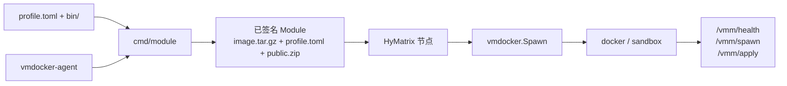

<div align="center">

# VMDocker V2

**HyMatrix 的容器化运行时**

[](go.mod)
[](LICENSE)

[English](README.md)

</div>

VMDocker V2 把 Docker 镜像封装为可签名、可分发、可验证的 HyMatrix Module，并在隔离的 `docker` 或 `sandbox` 后端中运行它。

**Module Format：** `hymx.vmdockerv2.v0.0.1`

## 从哪里开始

| 目标 | 入口 |
|---|---|
| 先理解项目 | [核心架构](#2-核心架构) |
| 验证代码可用 | [快速开始](#3-快速开始) |
| 创建自己的 Module | [构建并运行 Module](#4-构建并运行-module) |
| 完成构建 → Spawn → Export → 再 Spawn | [手动端到端往返测试](docs/manual-roundtrip-test_zh.md) |
| 排查运行问题 | [常见问题](#8-常见问题) |

## 1. 项目简介

VMDocker V2 是 HyMatrix 节点的 VM 扩展。节点收到 Spawn 后，VMDocker 校验 Module、准备镜像与独立工作区、启动运行时，然后通过 `/vmm/*` 接口转发 Spawn、Apply、Checkpoint 和 Restore。

V2 的核心变化是：构建发生在发布 Module 时，而不是 Spawn 时。Module 自带压缩镜像、`profile.toml` 和可选的 `public.zip`，因此启动端无需 Dockerfile 或在线重建。

适合以下场景：

- 为 HyMatrix 节点提供容器化计算运行时。
- 将 Claude、OpenClaw 或自定义 Agent 打包为 Module。
- 在多个进程之间隔离工作区，并支持受控导出。

## 2. 核心架构



一条请求的关键路径如下：

1. Module 作者用 `profile.toml` 声明基础镜像、工具、命令和公开文件。
2. `cmd/module` 生成标准 Dockerfile，构建并保存镜像，再签名生成 `mod-<id>.json`。
3. 节点 Spawn 时校验格式和镜像摘要；本地没有匹配镜像时，从 Module 执行 `docker image load`。
4. 每个进程获得独立工作区，镜像中的 `vmdocker-agent` 负责 VM HTTP 协议。

## 3. 快速开始

### 3.1 环境要求

| 依赖 | 用途 |
|---|---|
| Go 1.24.2+ | 构建并测试 `vmdockerv2` |
| Go 1.25+ | 创建 Module 时构建同级的 `vmdocker_agent` 仓库 |
| Docker CLI 与 daemon | 构建 Module，并运行容器工作负载 |
| Redis | 启动 HyMatrix 节点 |
| `vmdocker_agent` | 仅创建 Module 时需要 |

Linux 默认使用 `docker`。macOS 和 Windows 默认使用 `sandbox`，需要支持 `docker sandbox` 的 Docker Desktop；也可以在 Spawn 时显式选择 `docker`。

### 3.2 验证仓库

```bash
git clone https://github.com/cryptowizard0/vmdockerv2.git
cd vmdockerv2

go test ./...
go build -o ./build/hymx-node ./cmd
```

成功标准：测试通过，并生成 `build/hymx-node`。

### 3.3 启动本地节点

先启动 Redis：

```bash
docker run -d --name vmdockerv2-redis -p 6379:6379 redis:7-alpine
```

使用仓库内的开发配置启动节点。该配置包含公开的测试私钥，只能用于本地开发。

```bash
./build/hymx-node --config ./cmd/config.yaml
```

在另一个终端验证节点：

```bash
curl -fsS http://127.0.0.1:8080/info
```

返回节点 JSON 信息即表示 HTTP 服务可用。`/vmm/health` 是运行时容器的内部接口，不是节点的外部探活地址。

### 3.4 不接入链的本地能力测试

```bash
bash scripts/e2e_capability.sh
```

该脚本验证 Module 内容、工作区种子和容器挂载。真实镜像构建与 Spawn 是可选的重型检查：

```bash
RUN_REAL_SPAWN=1 bash scripts/e2e_capability.sh
```

## 4. 构建并运行 Module

以下流程面向 Module 作者。完整字段、构建产物和冷启动说明见 [profile-module-guide.md](docs/profile-module-guide.md)。

从构建 Adapter 到 Spawn、Export、再次 Spawn 的可复制详细步骤，请查看[手动端到端往返测试](docs/manual-roundtrip-test_zh.md)。

### 4.1 构建平台 Adapter

Module 镜像中的固定入口是 `vmdocker-agent`。它来自同级的 `vmdocker_agent` 仓库，并且必须与目标镜像架构一致。

```bash
cd ../vmdocker_agent
scripts/build.sh
export VMDOCKER_AGENT_BIN="$PWD/build/vmdocker-agent"
cd ../vmdockerv2
```

如需指定目标架构，使用 `scripts/build.sh amd64` 或 `scripts/build.sh arm64`。

### 4.2 创建最小 Profile

```text
myagent/
├── profile.toml
├── bin/
│   └── .keep
└── skills/
    └── soul.md
```

`myagent/profile.toml`：

```toml
[dockerfile]
FROM = "docker/sandbox-templates:shell"
bin = "bin"
# CMD = ["my-agent", "--serve"]

[vmdocker]
public = ["~/skills/*"]
```

`FROM` 和 `bin` 是必需项。`bin` 可以为空，但目录必须存在。`CMD` 可省略；设置后会成为镜像命令，由固定的 Adapter 入口启动。

### 4.3 配置构建环境

```bash
cp .env.example .env
```

建议用同一个 `.env` 配置 Module 构建和示例程序：

```dotenv
VMDOCKER_AGENT_BIN=/absolute/path/to/vmdocker_agent/build/vmdocker-agent
VMDOCKER_URL=http://127.0.0.1:8080
VMDOCKER_PRIVATE_KEY=0xreplace_with_a_development_key
RUNTIME_BACKEND=docker
```

`.env` 已被 Git 忽略。不要提交真实私钥。

`cmd/module` 必须获得 `VMDOCKER_PRIVATE_KEY` 和 Adapter 路径；路径可来自 `VMDOCKER_AGENT_BIN`，也可通过 `-agent-bin` 传入。`VMDOCKER_URL` 主要供示例程序连接节点。

### 4.4 构建并保存 Module

```bash
go run ./cmd/module \
  -profile ./myagent/profile.toml \
  -agent-bin "$VMDOCKER_AGENT_BIN"
```

命令会执行 `docker build`、`docker save` 和签名，并在当前目录生成 `mod-<id>.json`。将它放入节点工作目录的 `mod/`：

```bash
mkdir -p mod
cp mod-<id>.json mod/mod-<id>.json
```

### 4.5 启动 Module

在 `.env` 中填写构建得到的 Module ID，以及 `/info` 返回的节点账户地址：

```dotenv
VMDOCKER_MODULE_ID=<module-id>
VMDOCKER_SCHEDULER=<node-account-id>
RUNTIME_BACKEND=docker
```

首次使用本地完整节点时，可能需要先初始化 Token 和 Registry。随后执行 Spawn：

```bash
go run ./examples init
go run ./examples spawn
```

成功时会输出 `spawned pid: <process-id>`。完整的 Spawn、Export 和再次 Spawn 步骤见[手动端到端往返测试](docs/manual-roundtrip-test_zh.md)。

## 5. 运行后端

后端通过 Spawn tag `Runtime-Backend` 选择，不写入 Module。Module 只描述镜像，Spawn 决定本次实例如何运行。

| 平台 | 默认后端 | 可选后端 | 说明 |
|---|---|---|---|
| Linux | `docker` | `docker` | Linux 拒绝 `sandbox` |
| macOS / Windows | `sandbox` | `sandbox`, `docker` | `sandbox` 需要 Docker Sandbox CLI |

```go
[]schema.Tag{{Name: "Runtime-Backend", Value: "docker"}}
```

运行时类型通过 `Container-Env-RUNTIME_TYPE` 传入。它控制 Adapter 的就绪判断，例如 `claude`、`openclaw` 或 `test`；它不是 `profile.toml` 字段。

## 6. 配置参考

节点读取 YAML 配置。开发环境可从 [cmd/config.yaml](cmd/config.yaml) 开始，生产环境必须替换私钥、URL 和网络设置。

| 字段 | 说明 | 示例 |
|---|---|---|
| `port` | HTTP 监听地址 | `:8080` |
| `ginMode` | Gin 日志模式 | `debug`, `release` |
| `redisURL` | 节点状态使用的 Redis | `redis://@localhost:6379/0` |
| `arweaveURL` | Arweave 网关 | `https://arweave.net` |
| `hymxURL` | SDK 调用的节点 URL | `http://127.0.0.1:8080` |
| `prvKey` | 节点私钥；非空时优先 | `0x...` |
| `keyfilePath` | `prvKey` 为空时使用 | `./keyfile.json` |
| `nodeName` | 节点名称 | `my-node` |
| `nodeURL` | 其他节点可访问的地址 | `https://node.example.com` |
| `joinNetwork` | 是否加入网络 | `false`, `true` |

`enablePayment` 和 `enableChainkit` 属于可选子系统。只有启用时才需要填写对应配置。

## 7. 核心能力

### 自包含 Module

Module 包含 `image.tar.gz`、`profile.toml` 和可选 `public.zip`。Spawn 会校验 `Image-Name`、`Image-ID`、`Image-Source` 和归档格式。

旧的 `Build-Type` / `Build-*` Module 已不再支持。当前构建器使用 `container-tar+image.tar.gz`。

### 独立工作区

每个进程使用 `<node-working-directory>/sandbox_workspace/<pid>`，并映射为运行时的 `/home/hymx`。`docker` 后端使用只读根文件系统，`sandbox` 后端加固常见可写路径。

运行状态应写入工作区。完整目录与权限约束见 [sandbox-workspace-layout.md](spec/sandbox-workspace-layout.md)。

### Public 与 Export

`[vmdocker].public` 是 HOME 相对的导出白名单。构建和 Export 只收集匹配内容；未列出的文件保持私有。

```toml
[vmdocker]
public = ["~/skills/*", "~/persona/*.md", "~/investment.md"]
```

### Checkpoint 与 Restore

Checkpoint 保存工作区和 Adapter 暴露的运行时状态，Restore 将它恢复到目标实例。它不是通用的宿主进程内存快照；当前实现不要求安装 CRIU。

## 8. 常见问题

### 节点无法启动

- 确认 Redis 可访问：`redis-cli -u redis://@localhost:6379/0 ping`。
- 确认传入了实际配置路径：`--config ./cmd/config.yaml`。
- 本地配置只能用于开发；生产配置不要使用仓库中的测试私钥。

### `/info` 可用，但 Spawn 失败

- 确认 Docker daemon 正常：`docker info`。
- 确认 Module 位于节点当前工作目录的 `mod/mod-<id>.json`。
- 确认 `VMDOCKER_MODULE_ID` 和文件名中的 ID 完全一致。
- 检查镜像与宿主架构是否一致，例如 `amd64` 或 `arm64`。

### `unsupported module format`

只接受 `hymx.vmdockerv2.v0.0.1`。旧 V1 Module 或带 `Build-Type` 的 Module 需要用当前 `cmd/module` 重新构建。

### `docker sandbox CLI is not available`

更新到支持 `docker sandbox` 的 Docker Desktop，或在 macOS/Windows 的 Spawn tag 中显式使用 `Runtime-Backend=docker`。

### 容器启动后一直未就绪

确认镜像包含 `/usr/local/bin/vmdocker-agent`，并检查 `RUNTIME_TYPE` 是否与镜像匹配。Claude 和 OpenClaw 使用不同的就绪条件。

Claude 专项说明见 [claude-runtime.md](docs/claude-runtime.md)。

## 9. 开发与测试

```bash
# 全部单元测试
go test ./...

# 节点二进制
go build -o ./build/hymx-node ./cmd

# Module 与工作区能力
bash scripts/e2e_capability.sh

# 真实构建与 Spawn
RUN_REAL_SPAWN=1 bash scripts/e2e_capability.sh
```

深入文档：

- [Profile → Module 完整指南](docs/profile-module-guide.md)
- [手动端到端往返测试](docs/manual-roundtrip-test_zh.md)
- [Runtime 工作区规范](spec/sandbox-workspace-layout.md)
- [Claude Runtime](docs/claude-runtime.md)
- [E2E capability test](scripts/e2e_capability.md)
- [Module builder internals](vmdocker/modulebuild/README.md)

贡献代码前，请阅读 [AGENTS.md](AGENTS.md)。项目使用 [MIT License](LICENSE)。
